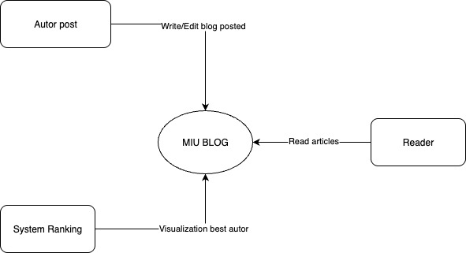
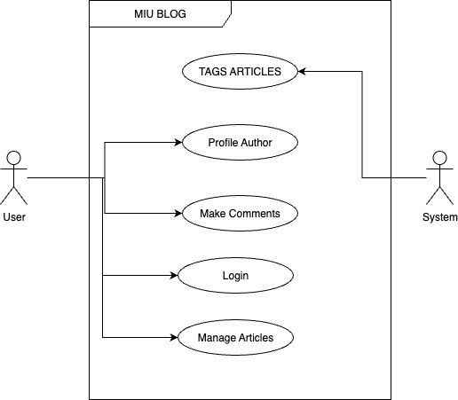

## Problem Statement

In today’s digital era, the ability to create, share, and engage with content online has become not only a personal outlet but also a professional necessity. Blogging platforms have grown into vital tools for storytelling, knowledge sharing, and even building personal brands. However, many of the existing systems are either overwhelmingly complex, insufficiently customizable, or lack the architectural clarity needed for developers, especially those looking to learn and grow through practical, full-stack development experience.

Recognizing this gap, <b>Maharishi International University</b> has proposed a meaningful challenge: to design and implement a modern, scalable, and developer-friendly blogging platform that mirrors the simplicity and power of platforms like Medium.com. The goal is not just to build a website, but to create a <b>learning vehicle</b> a real-world project that emphasizes best practices in software design while delivering a smooth, engaging user experience.

Despite the abundance of templates and tutorials available, few offer the kind of full-stack solution that developers truly need. Most backend systems fall short in key areas such as <b>clean RESTful API architecture</b>, <b>JWT-based authentication</b>, and <b>modular domain-layer separation</b>. On the frontend, developers often find themselves struggling with <b>reactive UI design</b>, lack of real-time feedback, and inconsistent integration with backend APIs. Additionally, combining features like <b>user authentication</b>, <b>article management</b>, and <b>social interaction</b> (e.g., following users, commenting on posts) into a cohesive, testable, and extensible platform remains a common hurdle.

### Addressing These Challenges: Our Vision

This project sets out to develop a **complete social blogging platform from scratch**, grounded in the principles of clean architecture and modern development. The application will support the full lifecycle of user-generated content while fostering community engagement through social features.

------
## Project Context Diagram

## User Cases Diagram

## User Stories

## 1. **Register / Authenticate**

- As a visitor, I want to register with an email and password so that I can access the platform.
- As a user, I want to log in using JWT so that I can access protected features.
- As a user, I want to log out securely.

------

### 2. **Manage Profile**

- As a user, I want to edit my profile so that I can update my personal information.
- As a user, I want to view other authors' profiles so that I can see their publications.
- As a user, I want to view my own profile with my articles and statistics.

------

### 3. **Write and Manage Articles**

- As an author, I want to create articles so that I can share my ideas.
- As an author, I want to edit my articles so that I can correct or update content.
- As an author, I want to delete articles I no longer wish to publish.

------

### 4. **Read Articles**

- As a user, I want to see a list of public articles so that I can stay informed.
- As a user, I want to view the details of a specific article.

------

### 5. **Socialize**

- As a user, I want to follow other authors so that I can see their new posts in my feed.
- As a user, I want to unfollow authors I’m no longer interested in.
- As a user, I want to comment on articles so that I can share my thoughts.

------

### 6. **Favorites and Tags**

- As a user, I want to favorite articles so that I can access them quickly later.
- As a user, I want to see all my favorited articles.
- As an author, I want to add tags to my articles so that they are easier to find.
- As a user, I want to view articles related to a specific tag. 

------

### 7. **View Author Rankings**

- As a user, I want to view the author rankings so that I can discover the most popular contributors.

------

## User Map

## Acceptance Criteria User Stories

### **User Story 1: Register with Email and Password**

**As a visitor**,
 I want to register with an email and password,  **so that** I can access the platform and start creating content.

####  Acceptance Criteria:

- **Given** I am a visitor on the registration page,
   **When** I enter a valid email and a password of at least 8 characters,
   **Then** my account should be created and I should be redirected to the login page or be automatically logged in.
- **Given** I enter an invalid email format,
   **When** I submit the registration form,
   **Then** I should see an error message indicating the email is invalid.
- **Given** I enter a password shorter than the required length,
   **When** I attempt to register,
   **Then** I should be prompted to choose a longer password.
- **Given** I try to register with an email that already exists,
   **When** I submit the form,
   **Then** I should see a message indicating the email is already taken.

------

### **User Story 2: Create New Article**

**As an author**, I want to create articles, **so that** I can share my thoughts with the community.

#### Acceptance Criteria:

- **Given** I am logged in,
   **When** I navigate to the "New Article" page and fill in the title, body, and tags,
   **Then** the article should be saved and published upon clicking "Publish".
- **Given** I leave required fields blank,
   **When** I attempt to submit the form,
   **Then** I should receive error messages highlighting the missing fields.
- **Given** I successfully publish an article,
   **When** I return to my profile,
   **Then** the new article should appear at the top of my article list.
- **Given** I am not logged in,
   **When** I try to access the "New Article" page,
   **Then** I should be redirected to the login page.

------

### **User Story 3: Follow an Author**

**As a user**, I want to follow other authors, **so that** I can see their articles in my personalized feed.

#### Acceptance Criteria:

- **Given** I am logged in,
   **When** I view another author’s profile and click the “Follow” button,
   **Then** the button should change to “Unfollow” and the author’s articles should appear in my feed.
- **Given** I have followed an author,
   **When** I go to my feed page,
   **Then** I should see their latest articles listed.
- **Given** I am not logged in,
   **When** I click the "Follow" button on an author's profile,
   **Then** I should be redirected to the login page.

- 

------

### Main Scenario

### **User Story 1: Register with Email and Password**

**Main Scenario (Happy Path):**

1. Visitor navigates to the **Registration** page.
2. Visitor enters a **valid email address**.
3. Visitor enters a **valid password** (minimum required length).
4. Visitor clicks the **"Register"** button.
5. System **validates** the input.
6. System **creates** a new user account in the database.
7. System **generates a JWT** or redirects the user to the **Login** page.
8. Visitor is **successfully registered** and optionally logged in.

------

### **User Story 2: Create New Article**

**Main Scenario (Happy Path):**

1. Author **logs in** to the system.
2. Author navigates to the **"New Article"** page.
3. Author fills in:
   - **Title**
   - **Body/content**
   - **Tags** (optional or required)
4. Author clicks the **"Publish"** button.
5. System **validates** all fields.
6. System **saves** the article to the database.
7. System **displays** a confirmation or redirects to the article’s detail page.
8. The article becomes **publicly visible** and is listed on the author's profile and homepage.

------

### **User Story 3: Follow an Author**

**Main Scenario (Happy Path):**

1. User **logs in** to the system.
2. User visits the **profile page** of another author.
3. User sees a **"Follow"** button.
4. User clicks the **"Follow"** button.
5. System verifies the user is authenticated.
6. System **creates a follower relationship** between the user and the author in the database.
7. The **"Follow"** button updates to **"Unfollow"**.
8. Articles by the followed author now appear in the user’s **personalized feed**.

